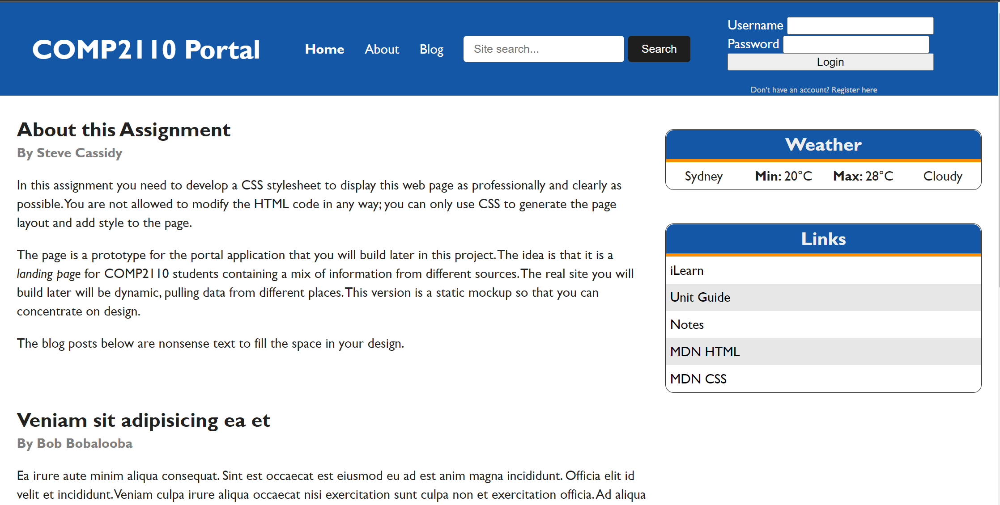

# COMP2110 Web Design Assignment

This semester we'll be writing a web application that implements a web portal.
The COMP2110 Portal will display information from a variety of sources in a
single page.  We'll get to the web application development later, but the first
task is to design the  page layout of this application.

This project contains a sample page in HTML, it contains various elements that
might be common for a front page like this - navigation, header, listings of
jobs, company reviews etc.

Your task is to complete the CSS stylesheet (`css/style.css`) to be included
from this page to make the page look as good as possible.  You are __not allowed
to change the HTML code__. You may only write CSS rules to reference what is
already in the page to change the layout and display properties. In this
respect, this exercise is similar to the CSS Zen Garden discussed in the 'CSS
Zen Garden' video.

The HTML page you are provided with contains many elements, classes and ids that
can be used in your CSS stylesheet rules.  There are standard elements such as
navigation lists and header blocks that you will find are similar to those used
in many CSS tutorials including the ones from the lecture material in this unit.  

You can use any browser you want to test your design but it should be a modern
one such as Chrome or Firefox.  It pays to test your design in alternate
browsers and with different browser window widths. A common error is to design
for a very wide monitor - this can mean that when someone views your page on a
laptop screen the design would not work.  Test your design at different browser
window sizes to check that it works ok.

If you want to reference images from your CSS rules, you can either include them
in this project (add them with git) or reference them via URL on the open
web (preferred).
